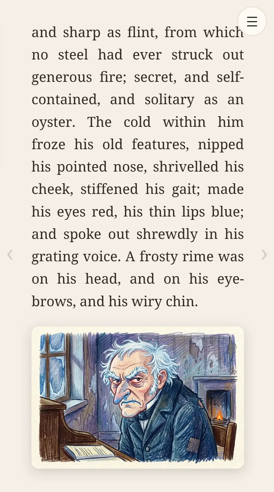
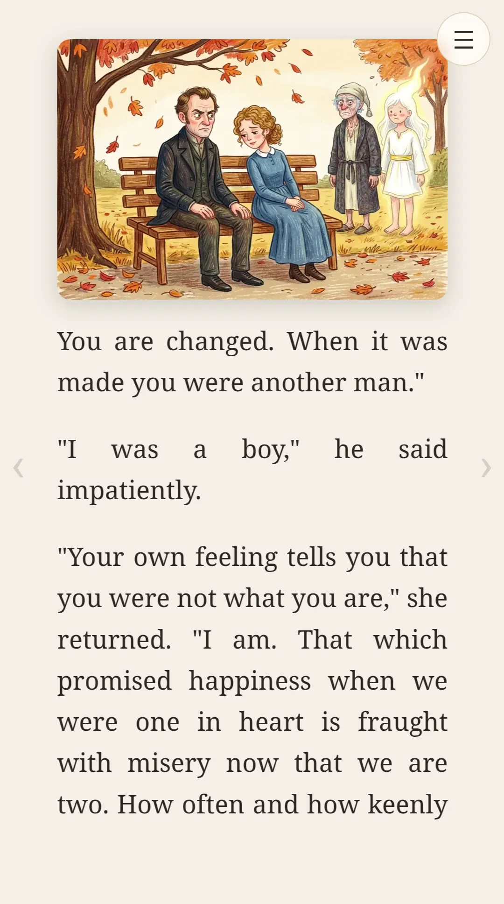
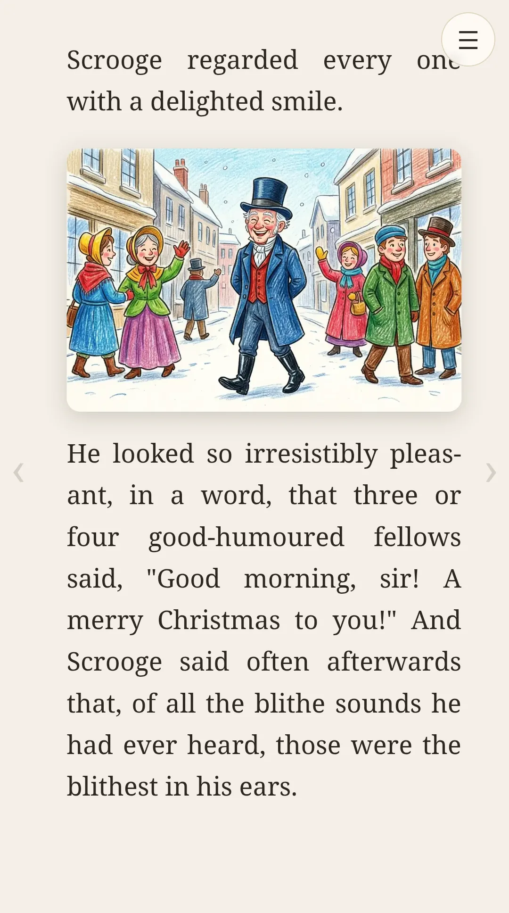

# Storyteller

**[Live demo →](https://achatham.github.io/storyteller-app/)**

  
  
  

This is an AI-illustrated rendering of a book. It creates consistent images across a
full story, with (mostly) the same characters and settings used across the pages.

I've found that my young children will pay attention to more sophisticated stories if
they're accompanied by color illustrations. I've had great luck reading to them so far
and hope you enjoy it too. Of course these images are nowhere near the quality and
consistency of a real human artist and I'd encourage you to look for those first.
