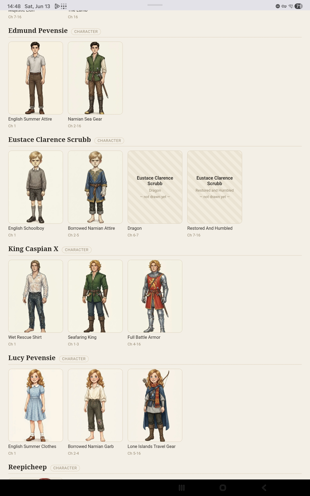

# Storyteller

**[Live demo →](https://achatham.github.io/storyteller-app/)**

This is an AI-illustrated rendering of a book. It creates consistent images across a
full story, with (mostly) the same characters and settings used across the pages.

  
  
  

I have small children and love reading to them. They _love_ books with color illustrations, but it's a struggle to find enough good, long-form content with color illustrations. I'm a huge fan of _The Princess in Black_, but I can only read it so many times. So I made this software to illustrate arbirtary books. It's not perfect -- children are great at finding inconsistencies -- but it does a serviceable job and lets me read more complex novels to young kids and train them up to appreciate more complex stories.

Illustrating a book costs $30-$50 worth of API calls, so this is not a way to save money, and I'd encourage you to use human-illustrated books where that's an option. But if you want to read a specific book with illustrations, this will let you do it. I'm currently reading _The Voyage of the Dawn Treader_ and _The Westing Game_ to my children, and they _love it_.

### How it works

I've rebuilt this app _at least_ 6 times, and this is the version which finally works well enough to use. This version was 100% vibe-coded, though I had a lot of input into the process.

It's a pipeline of LLM calls. To start, Gemini analyzes the entire book text and extracts a roster of characters, plus variants of them. The characters are illustrated lazily using Nano Banana 2 Pro, while page illustrations are created using Nano Banana 2 Flash. A separate Gemini call analyzes a chunk of text and decides where and what to illustrate. 

Each illustration references the central roster of characters, settings, and props, so we can reuse those and make a consistent set of images. As you can see below, it creates several different versions of the same charaters as they evolve throughout the story.

An LLM critic analyzes the pictures on several factors and trigggers a regeneration if the image fails its criteria.

### Running the Software

Copy `.env.example` to `.env` and add your own Gemini API key from [AI Studio](http://aistudio.google.com/). Then run `docker compose up --build` and visit http://localhost:8000/ and upload an unencrypted EPUB file.